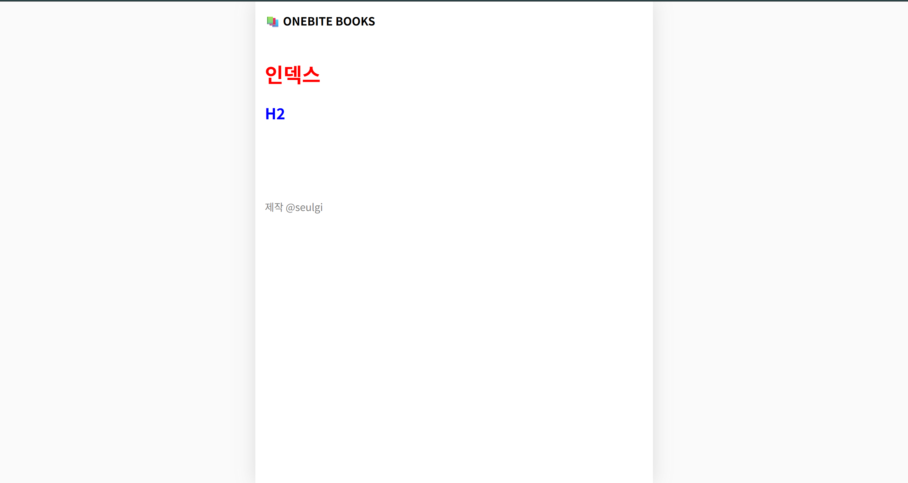
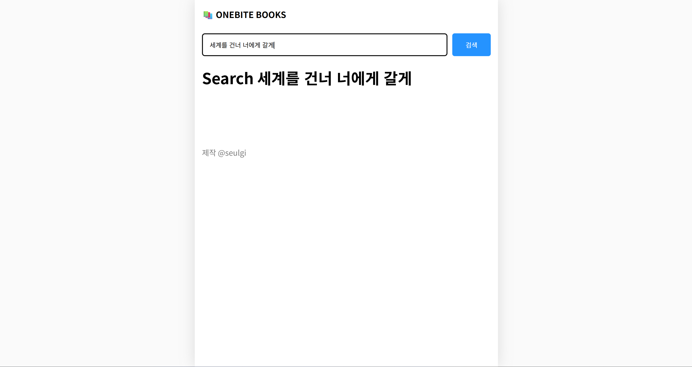

## API Routes

API Routes

:Next.js에서 API를 구축할 수 있게 해주는 기능

:백엔드 API가 하는 일과 동일하게 브라우저부터 요청을 받아서 전달을 해주는 기능 등을 할 수 있음.

`hello.ts`

함수 매개변수: req, res

상태코드 200: 요청이 성공적으로 처리되었음을 의미

`time.ts`

현재 시간 반환하는 코드

## 스타일링

inline style 방식: style 내용이 많을수록 가독성이 해쳐질 수 있음

=> CSS 따로 만들기

그냥 pages 폴더 안에 index.css 만든 후 `import "./index.css'` 하면 오류 발생함.

=>Global CSS Cannot be imported from files other than your Custom App

:글로벌 CSS 파일은 App 컴포넌트가 아닌 곳에서는 불러올 수 없다.

->app 컴포넌트가 아닌 다른 곳에서 css를 바로 불러오게 되면 다른 css와 충돌이 일어날 수도 있기 때문.

=> 해결법: **CSS 모듈**

=> css모듈에 `.module`을 추가하기

ex. index.module.css

=> CSS 모듈 사용하는 이유: Next에서는 페이지별로 css classname이 겹치는 것을 원천차단하기 위해 사용함.

## 글로벌 레이아웃 설정

레이아웃 설정

page 구분: main container, background

main container 안쪽에는 페이지 내용이 있음

- Header, Footer, 내용

searchpage

도서 상세 페이지

app component -> header, footer 등 페이지에 공통으로 적용되는 내용 넣기

=> `global-layout.tsx`로 정리하기

<글로벌 레이아웃>

## 페이지별 레이아웃 설정하기

index page: search bar

search page: search bar

book pagfe: search bar (X)

=> 일부 페이지에만 적용되는 페이지별 레이아웃 설정하기

=> `Home.getLayout` 사용

(자바스크립트 함수는 모두 객체이기 때문에 method를 추가할 수 있음)

App component는 현재 접속 요청이 온 페이지 역할을 하는 컴포넌트를 Component라는 인수로 받음.

index.tsx 파일에서 Home component의 getLayout이라는 메서드로 페이지 역할을 할 컴포넌트를 전달받아서 레이아웃을 적용해서 리턴하도록 만들어두었기 때문에 App component에서 그냥 getLayout 메서드를 불러와서 중괄호와 함꼐 호출하는 형태로 별도의 레이아웃을 적용할 수 있음.

searchbar가 적용되지 않는 페이지들이 오류가 발생하지 않도록 예외처리 해야함 (`??` 사용)

type error 해결

`type NextPageWithLayout = NextPage & {`
`getLayout? : (page: ReactNode) => ReactNode;`
`}`

